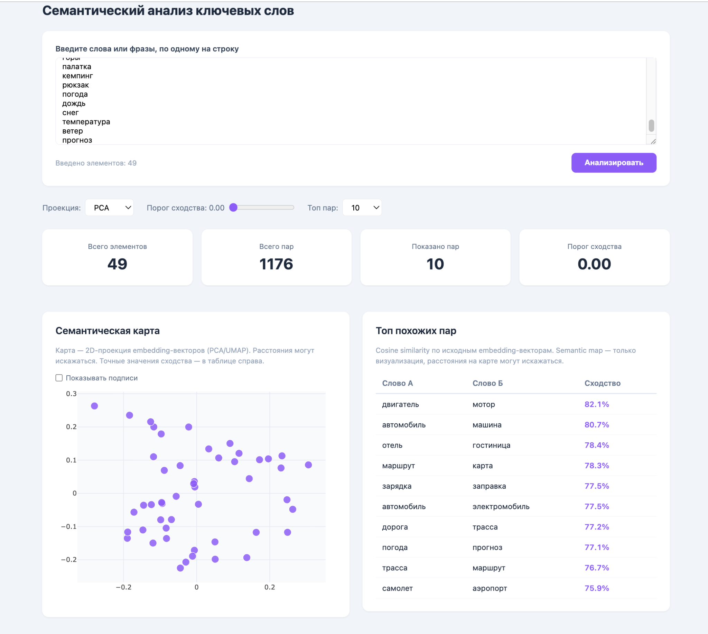

# Keyword Semantic Similarity Analyzer



Анализ семантической близости ключевых слов: keywords → локальные embeddings (LaBSE-en-ru) → cosine similarity → сортировка пар по убыванию + 2D semantic map.

**Внешние платные API не используются.** Embeddings генерируются локальной open-source моделью `cointegrated/LaBSE-en-ru`.

## Демо

http://157.22.252.36

## Быстрый старт

```bash
# Бэкенд — Python-зависимости для локальных эмбеддингов (единожды)
cd backend
python3 -m venv .venv
source .venv/bin/activate
pip install -r requirements.txt
deactivate

# Бэкенд — Node.js
cd backend
npm install
npm run dev                # http://localhost:4000

# Фронтенд
cd frontend
npm install
npm run dev                # http://localhost:5173
```

## .env

```env
PORT=4000
```

## API

### GET /api/health

```json
{
  "status": "ok",
  "embeddings": "local",
  "model": "cointegrated/LaBSE-en-ru"
}
```

### POST /api/analyze

**Вход:**

```json
{
  "keywords": ["seo", "продвижение", "оптимизация", "парсинг", "скрейпинг"],
  "method": "pca",
  "threshold": 0,
  "topN": 10
}
```

| Поле | Тип | По умолчанию | Ограничение | Описание |
|---|---|---|---|---|
| `keywords` | `string[]` | — | 2–200 строк, каждая ≤300 символов | Список слов/фраз |
| `method` | `"pca"` \| `"umap"` | `"pca"` | — | Метод 2D-проекции |
| `threshold` | `number` | `0` | 0–1 | Минимальное cosine similarity |
| `topN` | `number` | `25` | — | Количество возвращаемых пар |

**Выход:**

```json
{
  "stats": { "totalKeywords": 5 },
  "points": [
    {
      "keyword": "seo",
      "embeddingText": "seo",
      "x": 0.023,
      "y": -0.041,
      "nearest": [
        { "keyword": "оптимизация", "similarity": 0.8721 },
        { "keyword": "продвижение", "similarity": 0.8433 }
      ]
    }
  ],
  "pairs": [
    { "left": "парсинг", "right": "скрейпинг", "similarity": 0.9102 }
  ]
}
```

## Как это работает

1. **Embeddings** — backend держит persistent Python-воркер с моделью `cointegrated/LaBSE-en-ru` (768-мерные векторы, русский + английский). Модель грузится один раз при старте, запросы идут через stdin/stdout.
2. **Cosine similarity** — попарное сравнение всех векторов. Результат — таблица «Топ похожих пар», отсортированная по убыванию.
3. **Semantic map** — embedding-векторы сжимаются до 2D через PCA или UMAP и отображаются на scatter plot. Расстояния на карте могут искажаться и не являются точной метрикой. Точные значения — в таблице справа.

## Ошибки

| Ошибка | HTTP | Сообщение |
|---|---|---|
| Меньше 2 keywords | 400 | `At least 2 keywords are required` |
| Больше 200 keywords | 400 | `Maximum 200 keywords allowed` |
| Строка >300 символов | 400 | `Keyword at index N exceeds maximum length` |
| Пустая строка | 400 | `Keyword at index N must be a non-empty string` |
| Не массив строк | 400 | `"keywords" must be an array of strings` |
| Python не запущен | 502 | `Failed to start Python (python3)` |
| Ошибка Python-скрипта | 502 | `Python script exited with code ...` |
| Невалидный JSON от Python | 502 | `Invalid JSON from Python script` |

## Ограничения

- Первый запрос после старта бэкенда — ~3 сек (загрузка модели), последующие — мгновенно
- Модель в памяти: ~400 MB RAM (Python-воркер)
- UMAP без фиксированного random seed — расположение точек может незначительно меняться между запусками
- Кэша embeddings нет
- CSV upload, БД, авторизация, pgvector — не реализованы (выходят за рамки текущего ТЗ)
